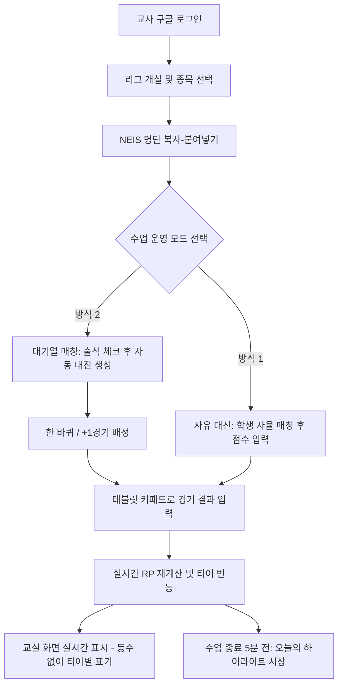

# [분석 보고서] 교실 리그(School League) 서비스 구조 및 핵심 메커니즘 분석

- **작성일자**: 2026-09-16
- **대상 URL**: [교실 리그 — 덕구랩](https://deokgu-lab.pages.dev/webs/school-league/) (서비스: `https://club-league.bau8584.workers.dev/school/`)
- **작성자**: 리드 사이언티스트 & 테크니컬 오너

---

## 1. 서비스 개요 및 목적

**교실 리그**는 초등교사(덕구랩)가 체육 수업 및 교실 자투리 시간에 배드민턴, 탁구, 알까기, 팔씨름 등 **1:1 및 2:2 대결 종목**을 체계적이고 즐겁게 운영하기 위해 설계한 웹 기반 수업 보조 도구입니다.

### 핵심 설계 철학
1. **극단적인 진입 장벽 제거**: 학생 계정/로그인 불필요, 별도 앱 설치 불필요, 교사 구글 계정 1개로 전 학급 운영.
2. **소외 없는 참여 유도**: 교사의 인위적 개입 없이 대기열 알고리즘을 통한 자연스러운 전원 참여.
3. **교육적 게이미피케이션**: 단순 승패 기록을 넘어 하위권 보호, 상위권 안주 방지, 친밀도 확장, 회복탄력성 강화를 점수 시스템(RP)에 내재화.
4. **학생 심리 및 개인정보 보호**: 서열화(등수) 지양, 익명성 보장(이름 마스킹 "권○○"), 읽기 전용 교실 화면 분리.

---

## 2. 주요 기능 및 사용자 흐름 (Workflow)

### 2.1. 시작 및 데이터 인입
- **종목 지원**: 배드민턴, 탁구, 테니스, 피클볼, 컬링 기본 탑재 + 자유 텍스트 입력(알까기, 팔씨름 등).
- **명단 자동 파싱**: NEIS(나이스) 출석부 복사 텍스트(`3 2 15 홍길동` 또는 `15 홍길동`)를 자동 인식하여 학년, 반, 번호, 이름을 분리.
- **반/학년 자동 필터링**: 명단 구성을 분석해 단일 반이면 필터 숨김, 다수 반/학년이면 탭/칩 자동 활성화.

### 2.2. 매칭 및 대기열 시스템 (Queue Engine)
- **출석 관리**: 미출석 학생 탭 한 번으로 결석 처리, 다수 반 합반 지원.
- **자동 대진 생성 로직**:
  - `한 바퀴`: 대기 중인 모든 학생이 공평하게 1회씩 경기하도록 일괄 편성.
  - `+1경기`: 개별 단일 경기 추가.
- **매칭 알고리즘 3대 모드**:
  1. **다양성 모드**: 최근 5경기 내 만나지 않은 상대 우선 매칭 (교우관계 확장).
  2. **밸런스 모드**: 상대 다양성과 실력 격차를 절충.
  3. **실력 모드**: RP(Rating Point)가 유사한 학생끼리 매칭 (접전 유도).

### 2.3. 디스플레이 분리 (교실 화면 vs 교사 관리 화면)
- **교실 화면 (`Public View`)**:
  - 전자칠판/학생용 태블릿 전용.
  - **등수(Rank) 완전 배제**: '26명 중 26등'과 같은 부정적 라벨링 방지.
  - **티어 그룹핑**: 브론즈/실버/골드 등 구간별 배치 + "다음 등급까지 OO점"으로 개인적 성장 동기 부여.
  - **버튼 제거 & 이름 마스킹**: 조작 방지 및 학생 개인정보 보호 (`권○○`).

---

## 3. 랭킹 & 점수(RP) 계산 메커니즘 분석

교실 리그의 가장 두드러진 기술적/교육적 특징은 **비대칭적 RP 보정 알고리즘**입니다.

### 3.1. 티어 구조 및 배치 시스템
- **티어 순서**: 언랭크(Unranked) → 브론즈 → 실버 → 골드 → 플래티넘 → 다이아 (기본 1000점 시작).
- **언랭크(배치고사)**: 지정 경기 수(예: 3~5경기)를 채우기 전까지 티어와 점수를 비공개하여 초기 패배로 인한 학습된 무기력 예방.
- **티어 기준점 프리셋**:
  - 단기·촘촘 (1개월): 실버 900 / 골드 1050 / 플래 1200 / 다이아 1380
  - 표준 (2개월): 실버 870 / 골드 1120 / 플래 1400 / 다이아 1720
  - 장기·넓게 (한 학기): 실버 850 / 골드 1200 / 플래 1650 / 다이아 2200
  - 정규분포·정밀 (스포츠클럽용)

### 3.2. 승패 기본 점수 (하후상박 구조)
실력 하위 구간은 진입을 장려하고, 최상위 구간은 독점을 방지하도록 비대칭 점수를 차등 적용:
- **브론즈**: 승리 `+24`, 패배 `-6` (승률 20%만 되어도 점수 상승 가능 → 효능감 증진)
- **다이아**: 승리 `+11`, 패배 `-27` (승률 75% 이상을 유지해야 유지 가능 → 안주 방지)

### 3.3. 보너스 점수 풀 (행동 유도 트리거)
| 항목 | 조건 및 효과 | 교육적 의도 |
| :--- | :--- | :--- |
| **오늘의 첫 승** | 당일 첫 경기 승리 시 `+12` | 매 수업 첫 경기 참여 유인 |
| **신규 매치** | 최근 5경기 내 미대결 상대와 매칭 시 `+5` (승패 무관) | 친한 아이끼리만 붙는 현상 타파 |
| **언더독 격파** | 상위 1/2/3티어 격파 시 `+6 / +12 / +20` | 상위권에 대한 도전 장려 |
| **복수 성공** | 최근 패배 상대에게 설욕 시 `+8` | 재도전 정신 고취 |
| **연승** | 3연승 이상 `+8` (플래티넘 이상은 비활성화) | 하위권 연승 축하, 상위권 양민학살 방지 |
| **명승부** | 1~3점 차 접전 승자 `+10/5/2`, **패자에게도 소액 부여** | 치열한 승부 자체에 대한 보상 |
| **패배 위로** | 2연패 중인 실버 이하 패배 시 `+4` 보상 (골드 이상 없음) | 저숙련자 탈락 방지 |
| **불굴의 의지** | 3/4/5연패 탈출 승리 시 `+8 / +12 / +16` | 포기 방지 및 회복탄력성 강화 |
| **캐리 (복식)** | 1단계 이상 낮은 파트너와 승리 시 고실력자에게 `+5/+7` | 약한 친구를 배척하지 않고 이끌도록 유도 |

### 3.4. 패널티 풀 (골드 이상 상위권 한정)
- **오만함의 대가**: 2티어 이상 하위 상대에게 패배 시 `-10 ~ -25`
- **굴욕적 완패**: 10점 차 이상 대패 시 추가 감점 (`-6 ~ -12`)
- **늪**: 연패 누적 시 패널티 가중 (다이아 3연패 `-13`)
- **휴면 감점**: 장기 미참여 시 점수 서서히 감쇄 (1등 고착화 방지)
- *브론즈/실버는 위 패널티 일체 면제.*

---

## 4. 사후 피드백 & 부가 기능

1. **하이라이트 (오늘의 어워드)**:
   - 수업 종료 후 5분 정리 시간에 당일 경기 데이터를 즉각 분석하여 자동 시상.
   - 수상 항목: 친구 넓히기(최다 신규 매치), 깜짝 승리(RP 격차 극복), 퍼펙트(무실점 승), RP 급상승, 강한 상대, 최다 출전 등.
   - 독점 방지 로직: 특정 우수 학생이 전 상을 휩쓸지 않도록 분배.
2. **시즌제 운용**:
   - 학기/대회 종료 시 기록 아카이빙 후 점수 리셋(전원 1000점 초기화), 학생 명단은 유지.
3. **선수 카드**:
   - 학생별 상세 전적, RP 추이, 당일/전체 승률, 최근 5경기 전적 제공 (학부모 상담 시 체육 참여 근거 자료로 활용).

---

## 5. 기술 구조 추정 및 한계점

### 5.1. 기술 스택 추정
- **프론트엔드/호스팅**: Cloudflare Pages / Workers (`workers.dev`, `pages.dev`)
- **인증**: 구글 OAuth (교사용 1개 계정)
- **데이터베이스/백엔드**: Supabase 또는 Cloudflare D1 / KV
- **UI 스타일**: 반응형 모바일/태블릿 최적화, 손글씨 감성 폰트 (개구체, 고운돋움)

### 5.2. 현재의 한계 및 확장 가능성
1. **인원수 제약**: 1:1 및 2:2만 지원 (축구, 피구, 농구 등 다인 단체 종목 미지원).
2. **단일 입력 창구**: 학생 개별 단말 입력이 아닌 교실 태블릿 1대 중심.
3. **네트워크 의존성**: 온라인 전용 서비스 (학교 방화벽/인터넷 이슈 취약).

---

## 6. 결론 및 향후 프로젝트 방향 시사점

본 서비스는 단순한 ELO 레이팅 기반 매치메이킹 앱을 넘어, **초등 교육 현장의 페인 포인트(소외 학생 발생, 과도한 승부욕 및 서열화로 인한 다툼, 교사의 행정 피로도)를 알고리즘과 UX 설계로 정밀하게 해결한 모범적 에듀테크 사례**입니다.

향후 본 프로젝트(`school_league`) 개발 또는 분석 시:
- 비대칭 보정치 수식화 및 시뮬레이터 구축
- 다양한 경기 규칙 및 토너먼트/스위스 리그 지원 가능성
- 오프라인 PWA 지원 및 로컬 데이터 저장 기능
등의 발전적 확장이 가능합니다.
