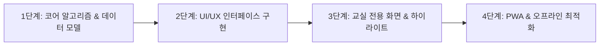

# [계획 보고서] 교실 리그(School League) 자체 구축 타당성 및 아키텍처 설계

- **작성일자**: 2026-09-16
- **환경 점검**: Node.js v24.14.1, npm 11.11.0, Python 3.12.10, Git 2.55.0
- **작성자**: 리드 사이언티스트 & 테크니컬 오너

---

## 1. 구현 타당성 (Feasibility Analysis)

**결론**: **100% 자체 구축 가능하며, 기존 서비스 대비 편의성과 오프라인 안정성을 대폭 개선할 수 있습니다.**

### 1.1. 런타임 및 개발 환경
현재 환경에 최신 웹 개발 런타임(Node.js v24, npm 11)과 데이터/알고리즘 검증을 위한 Python 3.12가 완벽하게 준비되어 있습니다.

### 1.2. 기존 원작 대비 개선 가능한 점
| 구분 | 덕구랩 교실 리그 | 우리가 구축할 개선 버전 |
| :--- | :--- | :--- |
| **네트워크 환경** | 온라인 전용 (서버/인터넷 필수) | **로컬/오프라인 우선 (PWA/IndexedDB)**: 학교 체육관 등 와이파이 음영 구역에서도 무중단 작동 |
| **데이터 소유권** | 외부 클라우드 의존 | 브라우저 로컬 저장 + JSON 백업/내보내기/가져오기 완벽 지원 |
| **매칭 확장성** | 1:1, 2:2 고정 | 1:1, 2:2 기본 지원 + 3:3, 4:4 및 모둠 리그 확장 토대 마련 |
| **알고리즘 검증** | 블랙박스 로직 | Python 기반 시뮬레이터(`scripts/`)로 RP 수렴도 및 매칭 공정성 사전 검증 |

---

## 2. 권장 기술 스택 및 아키텍처

### 2.1. 프론트엔드 & 클라이언트
- **Framework**: **React 18/19 + Vite + TypeScript**
  - 가볍고 빠른 번들링, 강력한 타입 안정성
- **UI / Styling**: **Tailwind CSS + Lucide React (아이콘)**
  - 초등학교 교실에 어울리는 따뜻하고 부드러운 디자인 톤
  - 터치 디바이스(태블릿/스마트폰/전자칠판)에 최적화된 반응형 UI & 큰 터치 타깃
- **상태 관리 & 스토리지**: **Zustand + IndexedDB / LocalStorage**
  - 새로고침이나 브라우저 종료 시에도 데이터 영구 보존
  - 교사 기기 간 동기화를 위한 내보내기/가져오기 기능

### 2.2. 핵심 알고리즘 모듈
1. **NEIS 명단 파서 (`roster-parser`)**:
   - `3 2 15 홍길동` 또는 `15 홍길동` 텍스트에서 학년, 반, 번호, 이름 정규식 추출
2. **대기열 & 매칭 엔진 (`match-queue`)**:
   - `한 바퀴` (전원 1경기 공평 배정)
   - 3대 매칭 모드: 다양성(최근 미대결 우선), 밸런스(균형), 실력(RP 유사)
3. **RP & 티어 엔진 (`rating-engine`)**:
   - 하후상박 승패 점수 (브론즈 +24/-6 ~ 다이아 +11/-27)
   - 보너스/패널티 풀 (첫 승, 신규 매치, 언더독, 패배 위로, 불굴의 의지, 캐리, 늪 등)
   - 언랭크 배치 시스템 (지정 경기 수 채우기 전 비공개)
4. **하이라이트 어워드 엔진 (`awards-engine`)**:
   - 당일 경기 분석 후 다면적 타이틀 자동 분배 (독점 방지 알고리즘 적용)

---

## 3. 단계별 구축 로드맵 (Roadmap)

- **Phase 1: 기반 구축 및 코어 엔진**
  - 프로젝트 셋업 (Vite + React + Tailwind + TS)
  - 핵심 모델 타입 정의 (Student, Match, League, Setting)
  - RP 산출 엔진 및 매칭 알고리즘 구현 & 유닛 테스트
- **Phase 2: 주요 인터랙션 화면**
  - 리그 생성 및 NEIS 명단 붙여넣기 모달
  - 대기열 관리 (출석 체크, 한 바퀴 대진 생성)
  - 태블릿 점수 입력 키패드 모달
  - 랭킹 및 선수 카드 뷰
- **Phase 3: 디스플레이 & 피드백**
  - 교실 전자칠판 전용 읽기 모드 (등수 숨김, 티어별 묶음, 마스킹)
  - 수업 종료 5분 하이라이트 시상 화면
- **Phase 4: 완성도 제고**
  - 데이터 백업/복원(JSON), 오프라인 지원, 프리셋 관리
