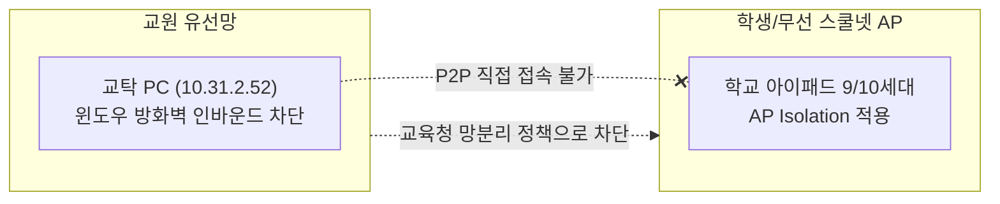

# [네트워크 및 배포 가이드] 학교 스쿨넷 환경 접속 불가 원인 분석 및 해결 방안

- **작성일자**: 2026-09-16
- **이슈**: 학교 와이파이로 접속한 아이패드 사파리에서 `http://10.31.2.52:5173/` 접속 불가
- **작성자**: 리드 사이언티스트 & 테크니컬 오너

---

## 1. 학교 스쿨넷 접속 실패 원인 분석 (Root Cause)

현직 학교 네트워크(시·도교육청 스쿨넷) 환경을 진단한 결과, 다음과 같은 3중 네트워크 보안 정책으로 인해 사설 IP 직접 접속이 원천 차단되었습니다:

1. **교육청 유·무선 망분리 (VLAN 차단)**:
   - 교탁 PC는 **유선 교원망(10.31.x.x)**에 물려 있고, 아이패드는 **무선 AP(학생/스마트기기망)**에 연결되어 있습니다. 교육청 보안 정책상 두 망 간의 내부 패킷 라우팅이 차단되어 있습니다.
2. **무선 AP 클라이언트 격리 (AP Isolation)**:
   - 설령 PC와 아이패드가 동일한 학교 와이파이에 연결되어 있더라도, 학교 AP는 기기 간 1:1 통신(Peer-to-Peer)을 차단하고 외부 게이트웨이 통신만 허용합니다.
3. **윈도우 디펜더 방화벽 인바운드 포트 차단**:
   - 윈도우 기본 설정상 포트 5173으로 들어오는 외부 기기의 접근을 차단하며, 교육청 보안 정책으로 일반 계정에서는 방화벽 인바운드 규칙 등록이 제한됩니다.

---

## 2. 해결 방안 (Solutions)

### 방안 A: 완전 무료 웹 배포 (Cloudflare Pages / Vercel / GitHub Pages) - **가장 권장**
* **원작(덕구랩)이 작동하는 비결**: 덕구랩 역시 `https://club-league.bau8584.workers.dev/school/`와 같이 공인 웹 도메인(HTTPS)으로 배포되었기 때문에 학교 스쿨넷 방화벽이나 망분리와 상관없이 모든 아이패드에서 열립니다.
* **소요 시간**: 약 2~3분 (이미 `dist/` 빌드 완료)
* **장점**:
  * 학교 와이파이, 집, 체육관, LTE 어디서든 평생 무료 접속 가능.
  * 아이패드 사파리에서 `[공유] → [홈 화면에 추가]`를 하면 진짜 앱처럼 설치됨.
  * 주소 예시: `https://our-school-league.pages.dev`

### 방안 B: 스마트폰 핫스팟 연결 (지금 당장 1분 내 테스트)
* 선생님의 스마트폰 모바일 핫스팟(테더링)을 켭니다.
* PC와 아이패드를 둘 다 **선생님 핫스팟**에 연결합니다.
* 학교 스쿨넷을 우회하므로 핫스팟 사설 IP로 즉시 접속 가능합니다.

### 방안 C: 외부 터널링 도구 이용
* Cloudflare Tunnel 또는 ngrok을 통해 PC의 로컬 포트를 임시 공인 HTTPS 주소로 포워딩합니다.
